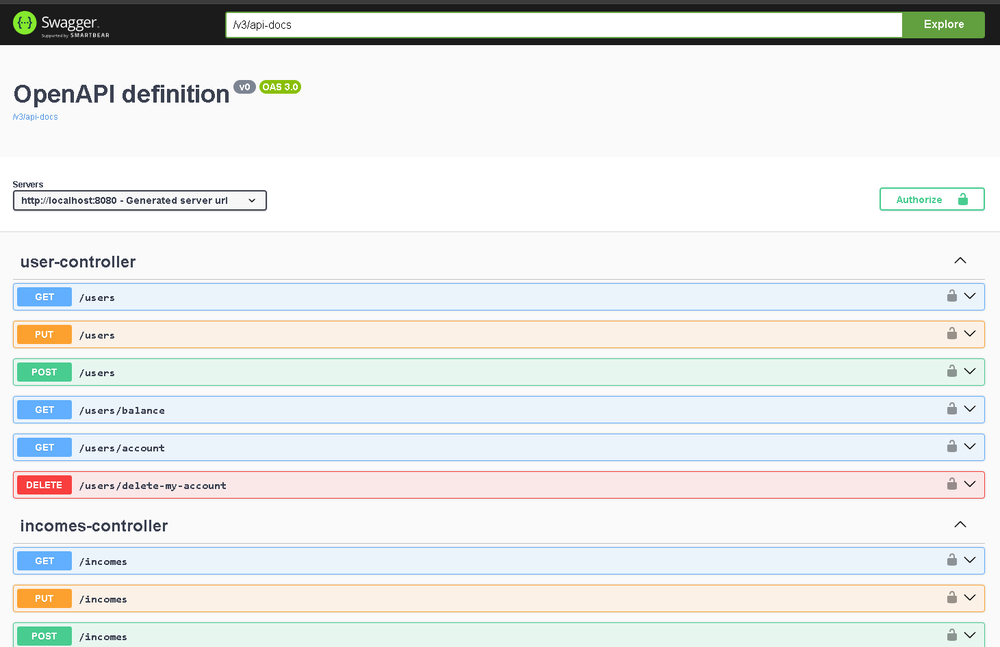
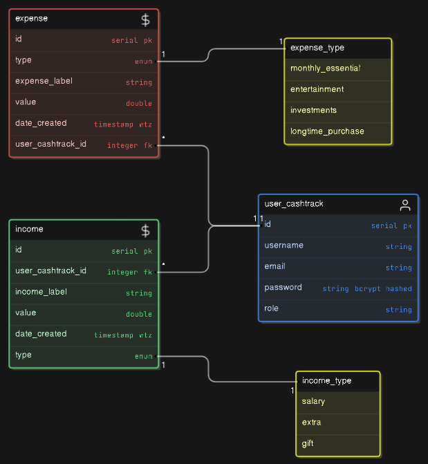
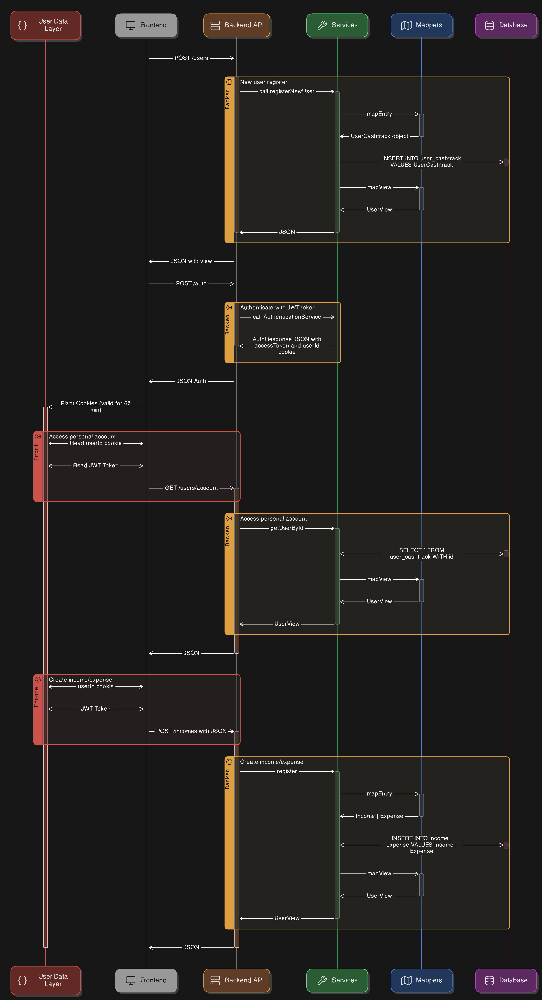
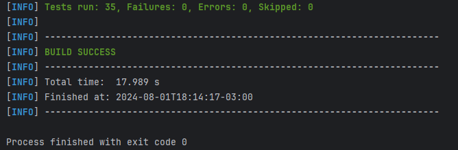
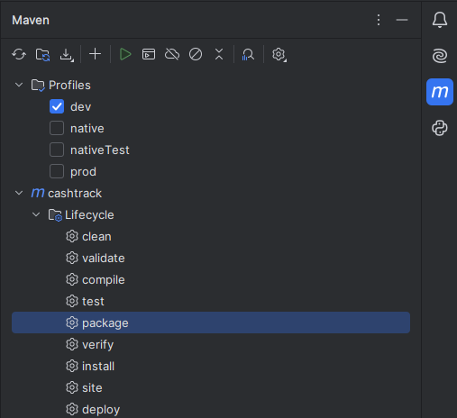
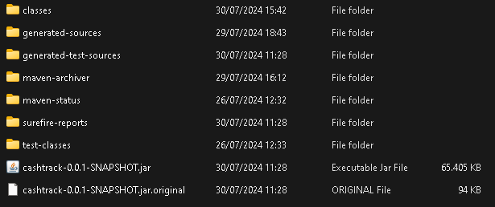
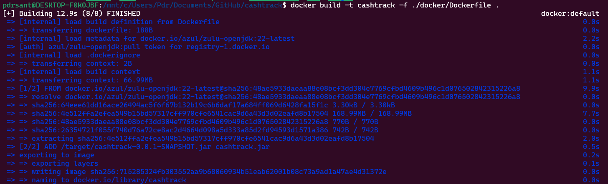
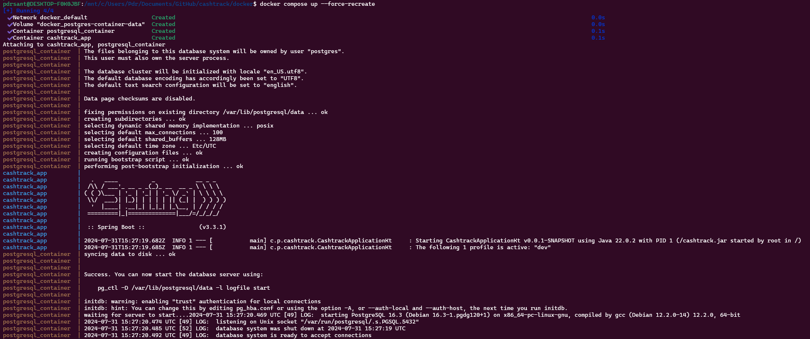
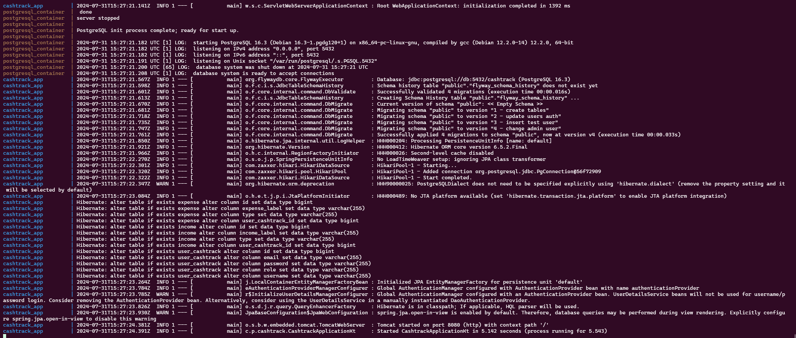
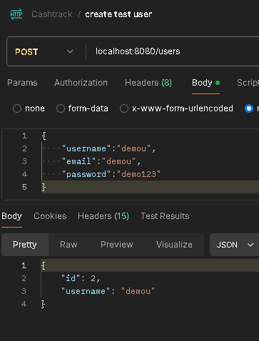

<a id="readme-top"></a>
<!--Template by https://github.com/othneildrew/Best-README-Template/tree/master-->

<!-- PROJECT LOGO -->
<br />
<div align="center">

<h3 align="center">Cashtrack</h3>

  <p align="center">
    A Kotlin + SpringBoot based application to track expenses with a user database. Implements all the guidelines of an
    API REST model, using a base CRUD on PostgreSQL.
    <br />
    <br />
    <a href="./docs/DOCS.md"><strong>EXPLORE THE DETAILED DOCS >></strong></a>
    <br />
    <br />
    <a href="https://cashtrack-deploy-production.up.railway.app">View Demo</a>
    ·
    <a href="https://github.com/P-py/cashtrack/issues/new?labels=bug&template=bug-report---.md">Report Bug</a>
    ·
    <a href="https://github.com/P-py/cashtrack/issues/new?labels=enhancement&template=feature-request---.md">Request Feature</a>
  </p>
</div>

<!-- TABLE OF CONTENTS -->
<details>
  <summary>Table of Contents</summary>
  <ol>
    <li>
      <a href="#about-the-project">About The Project</a>
    </li>
    <li>
      <a href="#getting-started">Getting Started</a>
      <ul>
        <li><a href="#prerequisites">Prerequisites</a></li>
        <li><a href="#models">Models</a></li>
        <li><a href="#installation">Installation</a></li>
      </ul>
    </li>
    <li><a href="#usage-local-deploy">Usage (local deploy)</a></li>
    <li>
      <a href="#roadmap">Roadmap</a>
      <ul>
        <li><a href="#upgrades-and-future">Upgrades and future</a></li>
      </ul>
    </li>
    <li><a href="#contributing">Contributing</a></li>
    <li><a href="#license">License</a></li>
    <li><a href="#contact">Contact</a></li>
    <li><a href="#acknowledgments">Acknowledgments</a></li>
  </ol>
</details>


<!-- ABOUT THE PROJECT -->
## About The Project

[![Stargazers][stars-shield]][stars-url]
[![MIT License][license-shield]][license-url]
[![LinkedIn][linkedin-shield]][linkedin-url]

[![Kotlin][kotlin-shield]][kotlin-url]
[![PostgreSQL][postgresql-shield]][postgresql-url]
[![Spring][spring-shield]][spring-url]




<p align="right">(<a href="#readme-top">back to top</a>)</p>

<!-- GETTING STARTED -->
## Getting Started

At the moment the project is running only locally, below you can read a step to step tutorial on how to setup the 
Database, prerequisites and run the project to test it.

**NOTE**: The project uses the module `spring-boot-starter-cache` for learning purposes only, that should not be used
in a production environment. 

**NOTE**: For learning purposes the project uses the `spring-security` module in a deprecated version that **SHOULD NOT**
be used in any other production project.

### Prerequisites

* [PostgreSQL + pgAdmin (or any other database administration tool)](https://www.postgresql.org/)
* [Kotlin](https://kotlinlang.org/)
* [IntelliJ or any other IDE](https://lp.jetbrains.com/intellij-idea-features-promo/?msclkid=ccc09177edfc14a0635df7e85211d254&utm_source=bing&utm_medium=cpc&utm_campaign=AMER_en_BR_IDEA_Branded&utm_term=intellij&utm_content=intellij%20idea)
* [Git](https://git-scm.com/)
* [Postman](https://www.postman.com/)
* JDK version 21 or up
* Kotlin version 2.0

In any directory you want to work on, clone the project: 
```bash
git clone https://github.com/P-py/cashtrack.git
```
### Models
<details>
  <summary>Database model</summary>
  
</details>
<details>
  <summary>API Dataflow</summary>
  
</details>

### Installation

_I do recommend you using IntelliJ for running, modifying and setting up this project locally, also you could use Postman for endpoints testing._
* [Postman](https://www.postman.com/)
* [IntelliJ or any other IDE](https://lp.jetbrains.com/intellij-idea-features-promo/?msclkid=ccc09177edfc14a0635df7e85211d254&utm_source=bing&utm_medium=cpc&utm_campaign=AMER_en_BR_IDEA_Branded&utm_term=intellij&utm_content=intellij%20idea)

**Recommended installation steps:**
1. Start by instally Docker if you are on linux or Docker Desktop if you are on Windows.
    ```bash
    sudo apt-get install docker-ce docker-ce-cli containerd.io docker-buildx-plugin docker-compose-plugin
    ```
    [`https://www.docker.com/products/docker-desktop/`](https://www.docker.com/products/docker-desktop/)

2. Test your docker docker installation
    ```
    sudo docker run hello-world
    ```
    or 
    ```
    docker run hello-world
    ```

<p align="right">(<a href="#readme-top">back to top</a>)</p>

<!-- USAGE EXAMPLES -->
## Usage (Local deploy)

### Running the unit tests

On the root folder of the project run:
```bash
mvn clean test
```

If the project is complete and compiling as expected, you should see logs like this:



### Deploy

**NOTE**: I do not recommend running the application without Docker Compose, it'll be more complicated, needing more setup steps and you may mess up something being unable to run it.

**1 - First of all, to run the application properly you'll need to set up the `application.yaml` and `docker-compose.yaml`:**

- Enter the `resources` folder using `cd src/main/resources` once you've cloned the repository
- Create a new `application.yaml` file and start editing it with the following layout:
  
  ```yaml
  spring:
  datasource:
    driverClassName: org.postgresql.Driver
    url: jdbc:postgresql://localhost:5432/ #DATABASE NAME HERE#
    #SHOULD BE LIKE jdbc:postgresql://localhost:5432/cashtrack
    username: #DATABASE USERNAME HERE#
    password: #DATABASE PASSWORD HERE#
  jpa:
    database: POSTGRESQL
    database-platform: org.hibernate.dialect.PostgreSQLDialect
    show-sql: true
    hibernate:
      ddl-auto: update
  flyway:
    driver-class-name: org.postgresql.Driver
    locations: db/migration
    password: #DATABASE PASSWORD HERE#
    url: jdbc:postgresql://localhost:5432/ #DATABASE NAHE HERE#
    #SHOULD BE LIKE jdbc:postgresql://localhost:5432/cashtrack
    user: #DATABASE USERNAME HERE#
  jwt:
  key: #JWT SECRET KEY HERE#
  access-token-expiration: 3600000 #ms
  refresh-token-expiration: 86400000 #ms
  ```

- **If you pretend to run it locally WITHOUT DOCKER**: Set up the variables hard-coded

- **If you pretend to run it with DOCKER COMPOSE**: Set up the field as environment variables like shown below
  - `${POSTGRESQL_DATABASE_URL}`
  - `${POSTGRESQL_DATABASE_USERNAME}`
  - `${POSTGRESQL_DATABASE_PASSWORD}`
  - `${JWT_KEY}`
  - In this case you should also **SET UP THE DOCKER COMPOSE FILE @ `docker/docker-compose-yaml`**

- For testing purposes it is okay to use the passwords and usernames in a hard-coded way, but it's not recommend to do
such thing in a deployment environment, in that case you should be using [_environment variables_](https://medium.com/chingu/an-introduction-to-environment-variables-and-how-to-use-them-f602f66d15fa)

**2 - Turning the application in a .jar to run the docker container**

**NOTE**: For this step to work, you'll need JDK version 21 or up, Maven and Kotlin.

- Open your particular terminal **on the root folder of the project** and run:
  ```bash
  mvn package
  ```

- **Or** Use the IntelliJ maven plugin to run the `mvn package`
  <details>
    <summary>Image example</summary>
    
  </details>

- After the command, if a successfull build was run you should note a `/target` folder with the compiled application.
  <details>
    <summary>Image example</summary>
    
  </details>

<p align="right">(<a href="#readme-top">back to top</a>)</p>

**3 - Building the docker image locally**

- Open up a terminal (I do recommend WSL terminal to mess with docker):

- Go into the **project root folder** and run:
  ```bash
  docker build -t cashtrack -f ./docker/Dockerfile .
  ```
  <details>
    <summary>Image example</summary>
    
  </details>

**4 - Composing the multi-docker deploy**
- Right after the previous command run:
  ```
  cd docker
  docker compose up
  ```

- Use `docker compose up --force-recreate` and delete all docker volumes if you encounter any postgres authentication errors.

- In case of success you should see logs like the example below
  <details>
    <summary>Example 1</summary>
    
  </details>
  <details>
    <summary>Example 2</summary>
    
  </details>
  <details>
    <summary>Example 3</summary>
    
  </details>

**5 - Testing! (finally)**

- Now, just open up the swagger UI at http://localhost:8080/swagger-ui/index.html#/, your postman or any other API  
testing platform and go test your local deploy!

  

<!-- ROADMAP -->
## Roadmap

- [X] Base CRUD
- [X] Data persistence
  - [X] Config JPA
    - [X] Entity mapping
    - [X] JPA and PostgreSQL dependencies
    - [X] Tests
  - [X] Flyway migrations
  - [x] Filtering and ordering
  - [x] Cache
- [x] Security and infrastructure
  - [X] Http Basic
  - [X] Tokens JWT Auth
  - [x] Profiles
  - [X] Docker
  - [X] Deploy
- [x] Unit tests and documentation
  - [x] Unit tests w/ mockK
  - [x] DB integration test
  - [x] MockMvc
  - [x] Swagger docs
- [ ] Advanced resources
  - [ ] Cache server w/ Redis
  - [ ] Spring Mail application
  - [ ] Thymeleaf
  - [ ] Pipelines

#### Upgrades and future
- [ ] Update search by label
  - Search engine on the income and expense endpoints `?label=[label]` is not optimized, returning only exact searches.
- [ ] Update security layer to new spring-boot methods with cryptography on any field
- [ ] Code cleaning refactor
- [ ] Month filtering for expenses, incomes and balance
- [ ] Create a changelog

<p align="right">(<a href="#readme-top">back to top</a>)</p>

<!-- CONTRIBUTING -->
## Contributing

Contributions are essential in the tech world, especially for beginners like me, they are what makes the open-source and dev world such an amazing place to learn and create. Any contributions you make are appreciated.

If you have a suggestion that would make this better, please fork the repo and create a pull request. Please give the project a star!

1. Fork the Project
2. Create your Feature Branch (`git checkout -b feature/AmazingFeature`)
3. Commit your Changes (`git commit -m 'Add some AmazingFeature'`)
4. Push to the Branch (`git push origin feature/AmazingFeature`)
5. Open a Pull Request

<p align="right">(<a href="#readme-top">back to top</a>)</p>

<!-- LICENSE -->
## License

Distributed under the MIT License. See `LICENSE` for more information.

<p align="right">(<a href="#readme-top">back to top</a>)</p>

<!-- CONTACT -->
## Contact

Pedro Salviano - [pedrosalviano170@gmail.com](mailto:pedrosalviano170@gmail.com)

Project Link: [https://github.com/P-py/cashtrack](https://github.com/P-py/cashtrack)

<p align="right">(<a href="#readme-top">back to top</a>)</p>

<!-- ACKNOWLEDGMENTS -->
## Acknowledgments
> View more [@DOCS](docs/DOCS.md#acknowledgements-and-context)

* [Alura Course - Kotlin + Spring Boot](https://www.alura.com.br/formacao-kotlin-spring-boot)
* [PostgreSQL Docs](https://www.postgresql.org/docs/) ~ best source to solve any postgres doubts
* [JPA database integration](https://docs.spring.io/spring-boot/appendix/application-properties/index.html)
* [Environment variables in IntelliJ](https://www.jetbrains.com/help/objc/add-environment-variables-and-program-arguments.html)

<p align="right">(<a href="#readme-top">back to top</a>)</p>

<!-- MARKDOWN LINKS & IMAGES -->
<!-- https://www.markdownguide.org/basic-syntax/#reference-style-links -->
[stars-shield]: https://img.shields.io/github/stars/P-py/cashtrack.svg?style=for-the-badge
[stars-url]: https://github.com/P-py/cashtrack/stargazers
[license-shield]: https://img.shields.io/github/license/P-py/cashtrack.svg?style=for-the-badge
[license-url]: https://github.com/P-py/cashtrack/blob/main/LICENSE
[linkedin-shield]: https://img.shields.io/badge/-LinkedIn-black.svg?style=for-the-badge&logo=linkedin&colorB=555
[linkedin-url]: https://www.linkedin.com/in/pedro-s-3742b7211/
[product-screenshot]: images/screenshot.png
[kotlin-shield]:  https://img.shields.io/badge/Kotlin-9E37BA?style=for-the-badge&logo=kotlin&logoColor=white
[kotlin-url]: https://kotlinlang.org/
[postgresql-shield]: https://img.shields.io/badge/PostgreSQL-689dc8?style=for-the-badge&logo=postgresql&logoColor=white
[postgresql-url]: https://www.postgresql.org/
[spring-shield]: https://img.shields.io/badge/Spring-6db33f?style=for-the-badge&logo=spring&logoColor=white
[spring-url]: https://spring.io/projects/spring-boot