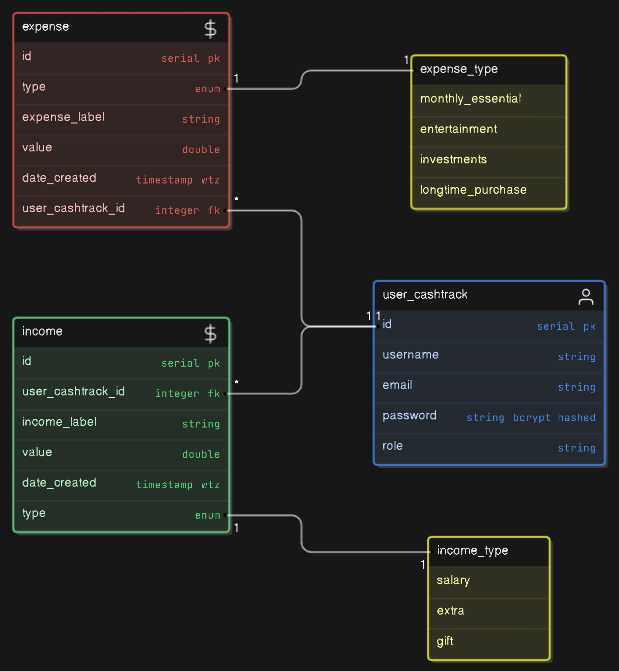
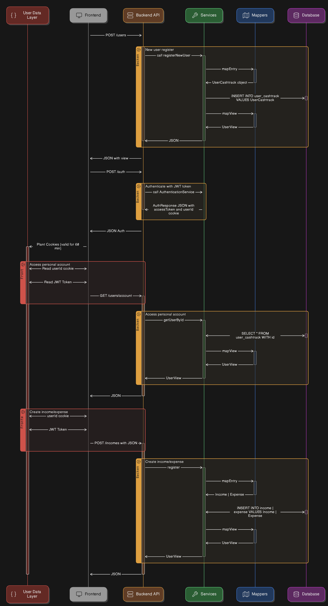

# CASHTRACK - DETAILED DOCS
## Overview
### Summary
This document is used to describe and explain the main functionalities of the project "Cashtrack", giving a generalist
view of the code structure, architecture and other main points.

### Impact and project scope
The project was developed mainly with the focus on bringing together all my Backend knowledge so far. Integrating the 
development of a REST API in Kotlin with the Spring Boot framework, in addition to persistence in the PostgreSQL 
database, security layer in Spring Security with JWT tokens.

You can view more about the development steps and layers on the [**Roadmap** @ the main README](../README.md#roadmap)

## Context
### Acknowledgements
* [Alura Course - Kotlin + Spring Boot](https://www.alura.com.br/formacao-kotlin-spring-boot)
* [PostgreSQL Docs](https://www.postgresql.org/docs/) ~ best source to solve any postgres doubts
* [JPA database integration](https://docs.spring.io/spring-boot/appendix/application-properties/index.html)
* [Environment variables in IntelliJ](https://www.jetbrains.com/help/objc/add-environment-variables-and-program-arguments.html)
* [Docker compose quick start](https://docs.docker.com/compose/gettingstarted/)
* [Codersee JWT Course](https://www.youtube.com/watch?v=iqkt9ip567A&list=PLvN8k8yxjoeud4ESoB-wjiieqYGaDVqPR&index=9)
* [Railway](https://railway.app) ~ If you need to deploy anything, go there
* [Using Cookies on Spring Security](https://dzone.com/articles/how-to-use-cookies-in-spring-boot)
* [Baeldung Spring Security](https://www.baeldung.com/spring-security-method-security)
* [JWT Tokens source docs](https://jwt.io/)

### Goals
- [X] Implement a Base CRUD
- [X] Data persistence layer with PostgreSQL
- [X] Security with JWT Auth
- [x] Turn into a docker compose for local tests 
- [x] Deploy for public view and test
- [x] Turn into a complete API REST model and endpoints
- [ ] Unit tests
- [ ] Swagger documentation
- [ ] Spring Mail integration
- [ ] Deployment pipelines
- [ ] Redis cache server

### Non goals
Points that are outside the initial project planning and scope
- Deploy for public use as a solution
- Frontend

## Operation rules
### Endpoints
- `/users`, `/expenses/admin-list`, `/incomes/admin-list`
  - **Permits only fully authenticated users with role ADMIN**
  - Receives `GET` requests and lists all data in a Pageable model - **available only for admin users on the system**
- `/auth` 
  - Used to authenticate existing users with `email` and `password`
  - Plants a session cookie with `accessToken` and `userId`
  - 
- `GET /users/account` for **fully authenticated users**
- `GET /users/balance` for **fully authenticated users**
- `GET /incomes` for **fully authenticated users**
  - Has `/incomes?label=[label]`, `/incomes/{id}` variants
  - `/incomes?label=[label]` returns the list of incomes with that label
  - `/incomes/{id}` returns the details for a specific income registered
    - Only permits the request if the income registered belongs to the user authenticated
- `GET /expenses` for **fully authenticated users**
  - Also has `/expenses?label=[label]` and `/expenses/{id}` variants working the same as the incomes endpoint
- `POST /users`
  - Used to create a new user
  - Works with _no authentication_
  - **Validates if a user with that e-mail already exists**
- `POST /expenses` for **fully authenticated users**
  - Creates a new expense for the authenticated user
- `POST /incomes` for **fully authenticated users**
- `DELETE /users/delete-my-account`, `DELETE /expenses/{id}`, `DELETE /incomes/{id}` for **fully authenticated users**

### Security
- Uses JWT Tokens for login, the session expires in `60 minutes` and does not have the option for a refresh token, forcing
the user to login again.

- For more info check [JWT Tokens](https://jwt.io/) and [Spring Security](https://spring.io/projects/spring-security)

### Usage
- The user creates an account by registering a username, email and password, after the registration the user should follow
to the Auth step, where the login is executed with the email and password registered before, at this step the user's 
browser or platform will receive a `accessToken` and `userId` cookie.

- Once authenticated the session will be alive for 60 minutes, time when the user can create expenses, view his balance, 
create incomes, label any of those, delete any of those, view his account details and more.

- It's also possible for the user to delete its account at any moment, cascading the deleting of the expenses and incomes
related to the account.

## System design
- The backend is made of a Kotlin application, on the API REST model, using Spring Boot as the main framework.
- The database is implemented using PostgreSQL, the model can be viewed below.
  

      
Click here to open/close image view

      
  

- View the complete data flow below
  

      
Click here to open/close image view

      
   

